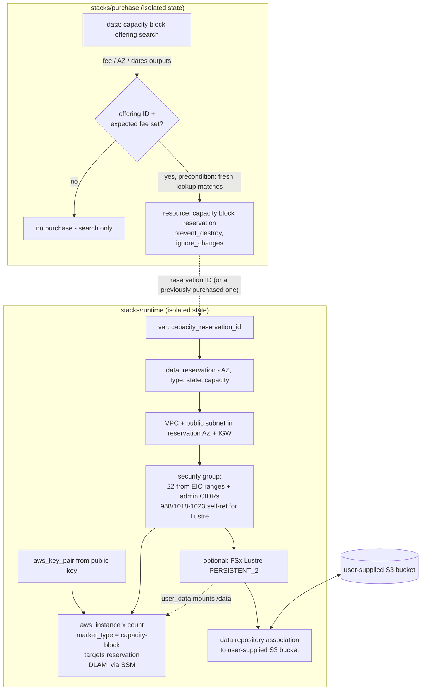
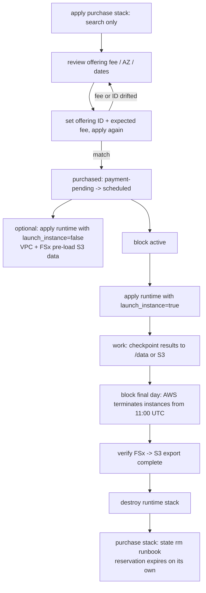

# Capacity Block GPU Infrastructure - Plan

## Goal Capsule

- **Objective:** An OpenTofu configuration that searches for and purchases EC2 Capacity Blocks for ML (p5.48xlarge / p5en.48xlarge), launches GPU instances into a new or previously purchased block, optionally provisions an S3-linked FSx for Lustre file system at `/data`, and provides SSH + EC2 Instance Connect access — with no secrets in this public repo or in OpenTofu state.
- **Authority:** This plan > repo conventions (none exist yet — this is greenfield). Requirements (R-IDs) win on product behavior; KTDs win on implementation mechanism.
- **Execution profile:** `execution: code`, but almost entirely HCL configuration and documentation. No application code, no unit-test framework beyond `tofu test` and static gates.
- **Stop conditions:** Never run an apply that purchases a real capacity block or creates billable AWS resources during implementation — verification is static (fmt/validate/tflint/test with mocks). Never commit a `.tfvars` file, private key, or state file. Surface a blocker instead of guessing if a provider argument named here does not validate.
- **Tail ownership:** The executing workflow (`ce-work` or equivalent) owns commits, PR, and CI.

---

## Product Contract

### Summary

Build two isolated OpenTofu root stacks in this repo: a **purchase stack** that searches capacity block offerings and buys one only on explicit double-confirmation, and a **runtime stack** that creates a minimal VPC, launches p5-class instances into a capacity block reservation on the AL2-based Deep Learning AMI, optionally attaches an S3-linked FSx for Lustre at `/data`, and wires up key-pair plus EC2 Instance Connect access. Documentation carries the cost and data-safety runbooks (purchase workflow, block expiry, teardown).

### Problem Frame

The Multi-Scale project needs on-demand access to top-tier GPU capacity. p5-class instances are effectively only obtainable through EC2 Capacity Blocks for ML — reserved windows paid upfront. Provisioning by hand is error-prone in the expensive direction: a capacity block purchase is immediate, non-refundable, and cannot be cancelled; instances are terminated when the block ends; and FSx bills continuously once created. The repo is public and open source, so the configuration must be safe to publish: no secrets in git, none in state, and no way for a fresh-clone `tofu apply` to spend five figures by accident.

### Requirements

**Capacity blocks**

- R1. An operator can search capacity block offerings for the target instance types by instance count, duration, and date range, and review the offering's upfront fee, availability zone, and start/end dates before any purchase.
- R2. A purchase happens only on explicit opt-in pinned to a reviewed offering ID and its expected fee; an apply without that confirmation never purchases.
- R3. Instances launch into either the newly purchased reservation or a previously purchased reservation supplied by ID.

**Instance**

- R4. Instances run the Amazon Linux 2-based Deep Learning AMI by default, with a variable switch to the AL2023 Deep Learning AMI.
- R5. An operator with no key pair gets one: a helper generates the key locally and only the public key is registered with AWS. An existing key pair can be used by name instead.
- R6. EC2 Instance Connect works for admins out of the box: the package is present on the instance, the security group admits the regional Instance Connect service ranges, and a sample admin IAM policy ships with the repo.

**Storage**

- R7. An optional FSx for Lustre file system mounts at `/data`, linked to a user-supplied S3 bucket, with operator-chosen size within AWS-valid values. When disabled, no FSx resources are created.

**Safety and hygiene**

- R8. No secrets in the repository or in OpenTofu state.
- R9. The runtime stack is self-contained: it creates its own minimal VPC with a public subnet in the reservation's availability zone.
- R10. Operations that spend money or destroy data require an explicit, documented confirmation step (purchase double-confirmation, write-once purchase stack, expiry and teardown runbooks, FSx-disable warning).

### Acceptance Examples

- AE1. **Search is free.** Given a fresh clone and AWS credentials, when the operator applies the purchase stack with only search variables set, then no reservation is created and outputs show the matching offering's fee, AZ, and dates. Covers R1, R2.
- AE2. **Purchase is double-confirmed.** Given a reviewed offering, when the operator sets the offering ID and the expected upfront fee and both still match a fresh lookup, apply purchases the block; when either has drifted, apply fails before purchasing. Covers R2.
- AE3. **Existing block launch.** Given a previously purchased reservation ID for an active block, runtime apply launches the instance into it with a public IP, and an admin can connect with `aws ec2-instance-connect ssh`. Covers R3, R6.
- AE4. **FSx is genuinely optional.** With FSx disabled, a plan shows zero FSx resources. With FSx enabled and a bucket supplied, `/data` is mounted and bucket objects are visible (lazy-loaded). Covers R7.
- AE5. **Scheduled-block apply is legible.** Given a reservation that is `scheduled` but not yet `active`, apply with instance launch enabled fails with a human-readable precondition message; with instance launch disabled, networking and FSx apply cleanly (pre-loading data before the block starts). Covers R3, R10.

### Scope Boundaries

**Out of scope**

- Multi-node distributed training topology: EFA fabric configuration, placement groups, cluster schedulers (Slurm, ParallelCluster), EKS/SageMaker integration.
- UltraServer capacity blocks (different offering API shape: `ultraserver_type`/`ultraserver_count`).
- Managing admin IAM identities — the repo ships a sample policy document only (see origin of gap: multi-admin flow analysis).
- CI/CD pipelines for OpenTofu runs; remote-state bucket bootstrapping.

**Deferred to Follow-Up Work**

- EventBridge/SNS alerts for capacity-block end-approaching and instance-termination events.
- Private-subnet variant using an EC2 Instance Connect Endpoint (no public IP).
- Automated FSx-to-S3 export-verification script for the teardown runbook.
- Capacity block sharing across AWS Organization accounts.
- Multi-instance clusters within one block (`instance_count` > 1 launches N identical instances, but no cluster networking).

---

## Planning Contract

### Key Technical Decisions

- KTD1. **Two isolated root stacks with separate state** — `stacks/purchase` and `stacks/runtime`. An errant apply or destroy in the runtime stack can never touch the non-refundable reservation. Community consensus for irreversible resources favors state isolation over lifecycle arguments alone.
- KTD2. **Target instance types are p5.48xlarge and p5en.48xlarge** (session-settled: user-approved — chosen over literal p5n.48xlarge: p5n is not an EC2 type; the P5 family is p5/p5e/p5en, and p5en is confirmed supported by Capacity Blocks).
- KTD3. **Default AMI is the Deep Learning Base OSS NVIDIA Driver AMI (Amazon Linux 2), resolved via SSM parameter, with a variable switch to the AL2023 equivalent** (session-settled: user-approved — chosen over base AL2 and AL2023: keeps the stated AL2 requirement while shipping NVIDIA drivers and EFA support). Conflict note from research: AL2 reached end of life 2026-06-30 and the AL2 DLAMI is frozen at its final release — it still resolves and works, but receives no security patches. The AL2023 switch (`/aws/service/deeplearning/ami/x86_64/base-oss-nvidia-driver-gpu-amazon-linux-2023/latest/ami-id` — note the extra `-gpu` path segment vs AL2) is the documented escape hatch, and the README must state the frozen status.
- KTD4. **The runtime stack creates a minimal VPC; the subnet's AZ is derived from the reservation** via the `aws_ec2_capacity_block_reservation` data source (session-settled: user-approved — chosen over existing-VPC input: self-contained is simplest for a fresh account). Capacity blocks are AZ-pinned; deriving the AZ removes the top misconfiguration risk.
- KTD5. **Admin access is public IP + EC2 Instance Connect** (session-settled: user-approved — chosen over a private EC2 Instance Connect Endpoint: simpler for a small admin group). Security group ingress on port 22 comes from the `aws_ip_ranges` data source filtered to service `ec2_instance_connect` — no AWS-managed prefix list exists for this service — plus an optional `admin_cidr_blocks` variable, because CLI-initiated `aws ec2-instance-connect ssh` connects from the admin's own IP, not the service range.
- KTD6. **Key pairs are registered from a user-supplied public key; a helper script runs `ssh-keygen` locally when the user has none.** The `tls_private_key` resource is prohibited — it stores the private key unencrypted in state, violating R8. `aws_key_pair` stores only public material.
- KTD7. **FSx uses deployment type PERSISTENT_2 with a Data Repository Association to the S3 bucket.** PERSISTENT_2 is the only deployment type supporting DRA auto-export; the legacy `import_path`/`export_path` arguments are explicitly unsupported on PERSISTENT_2 and lack auto-sync elsewhere. Auto-import events default to NEW/CHANGED/DELETED; auto-export defaults on with the same events and is switchable off for read-only training buckets.
- KTD8. **Purchase is double-confirmed and the purchase stack is write-once.** The reservation resource is count-gated on the operator setting both `capacity_block_offering_id` and `expected_upfront_fee`; preconditions compare both against a fresh offering lookup and fail the apply on drift (offering IDs are ephemeral quotes that change between plan and apply). After purchase, the search is gated off (offering searches can error on zero results, which would wedge the stack), the reservation carries `prevent_destroy` plus `ignore_changes` on the offering ID, and the README documents the stack as one purchase per state — a second block means a fresh state or workspace.
- KTD9. **Pre-activation provisioning is a feature, not an accident.** A `launch_instance` flag lets the operator apply networking and FSx before the block starts (to pre-load training data from S3), while the instance resource carries a precondition requiring the reservation to be `active`, with a human-readable message. FSx's continuous billing before block start is documented cost.
- KTD10. **Version floors: OpenTofu >= 1.10, AWS provider >= 6.53, < 7.0.** The capacity block reservation data source (needed for KTD4) landed in provider 6.53.0; OpenTofu 1.10 brings S3-native state locking (`use_lockfile`). The S3 backend ships as a documented, commented example — never a hardcoded bucket — and an optional OpenTofu state-encryption block (AWS KMS key provider) is documented as defense-in-depth for R8.

### High-Level Technical Design

Stack topology and resource ownership:



Operational lifecycle the documentation must carry:



### Output Structure

```text
stacks/
  purchase/
    main.tf              # offering search + gated reservation
    variables.tf
    outputs.tf
    versions.tf
    terraform.tfvars.example
  runtime/
    main.tf              # reservation data source, locals
    network.tf           # VPC, subnet, IGW, routes
    security.tf          # SG: EIC ranges, admin CIDRs, Lustre ports
    access.tf            # key pair
    instance.tf          # AMI resolution, aws_instance, user_data
    fsx.tf               # conditional FSx + DRA
    variables.tf
    outputs.tf
    versions.tf
    terraform.tfvars.example
    templates/
      user_data.sh.tpl
tests/                   # tofu test files with mocked providers (per stack)
scripts/
  generate-key.sh        # local ssh-keygen helper
docs/
  admin-access.md        # EIC usage + sample IAM policy
  runbooks.md            # purchase, expiry, teardown, next-block
.pre-commit-config.yaml
README.md
```

The tree is a scope declaration; the implementer may adjust the layout if implementation reveals a better one. Per-unit `Files` lists stay authoritative.

---

## Implementation Units

### U1. Repo scaffolding and hygiene gates

- **Goal:** Both stacks exist as valid empty-ish roots with version pins, example tfvars, backend documentation, and pre-commit gates, so every later unit lands against working tooling.
- **Requirements:** R8, R10 (hygiene surface); enables all others.
- **Dependencies:** none.
- **Files:** `stacks/purchase/versions.tf`, `stacks/runtime/versions.tf`, `stacks/purchase/terraform.tfvars.example`, `stacks/runtime/terraform.tfvars.example`, `.pre-commit-config.yaml`, `README.md` (skeleton with cost-warning section stub), commented S3 backend + state-encryption examples per KTD10.
- **Approach:** Pin per KTD10. Use the OpenTofu-oriented pre-commit hooks (`tofu fmt`, `tofu validate`, tflint, trivy, terraform-docs, detect-private-key). The existing `.gitignore` already excludes tfvars and state — verify it also catches `*.pem`/`*.key` and add if not.
- **Patterns to follow:** `tofuutils/pre-commit-opentofu` hook conventions.
- **Test scenarios:** Test expectation: tooling gates, not unit tests — `pre-commit run --all-files` passes on the scaffold; `tofu init -backend=false && tofu validate` succeeds in both stacks; a planted dummy `.tfvars` and `.pem` file are ignored by git and flagged by detect-private-key respectively (then removed).
- **Verification:** Both stacks validate; pre-commit is green; README skeleton renders with the cost warning stub.

### U2. Purchase stack: search and gated purchase

- **Goal:** The full R1/R2 flow — free search with reviewable outputs, and a purchase that can only happen deliberately.
- **Requirements:** R1, R2, R10 (per KTD8).
- **Dependencies:** U1.
- **Files:** `stacks/purchase/main.tf`, `stacks/purchase/variables.tf`, `stacks/purchase/outputs.tf`, `tests/purchase.tftest.hcl`.
- **Approach:**
  1. Search variables: `instance_type` (validated to the two types per KTD2), `instance_count`, `capacity_duration_hours`, `start_date_range`/`end_date_range`; data source `aws_ec2_capacity_block_offering`, gated off after purchase per KTD8.
  2. Outputs surface `upfront_fee`, `currency_code`, `availability_zone`, start/end dates, and the offering ID — the review surface for AE1/AE2.
  2b. Region awareness: p5 and p5en capacity blocks are offered in different region sets (both are in us-east-1/2, us-west-1/2, eu-north-1, eu-west-2, ap-northeast-1, ap-south-1, ap-southeast-2/3; p5en adds eu-south-2 and ap-northeast-2; p5 adds sa-east-1). An empty search result can mean wrong region, not no capacity — the tfvars example and README must carry this table, since variable validation cannot encode a region-by-type matrix that AWS changes over time.
  3. Confirmation variables `capacity_block_offering_id` and `expected_upfront_fee` (both null by default) count-gate `aws_ec2_capacity_block_reservation` with preconditions per KTD8; lifecycle `prevent_destroy` + `ignore_changes`.
  4. Output the reservation ID, AZ, and end date for handoff to the runtime stack.
- **Execution note:** This resource costs real money on apply and is flagged best-effort-tested by the provider itself. Prove behavior with `tofu test` mocks and `validate` only; never apply against a real account.
- **Test scenarios:**
  - Happy path: with only search variables set, plan creates zero resources (AE1).
  - Confirmation gating: offering ID set but expected fee null → plan/test fails validation demanding both.
  - Drift guard: mocked offering fee differing from `expected_upfront_fee` → precondition fails with a message naming both values (AE2).
  - Edge: `instance_type` outside the two allowed values → variable validation error.
  - Error path: destroy attempt against a mocked reservation → blocked by `prevent_destroy`.
- **Verification:** `tofu test` passes with mocked provider; outputs documented via terraform-docs.

### U3. Runtime stack: networking, security group, and access

- **Goal:** Self-contained network in the reservation's AZ, an SG that admits EC2 Instance Connect and Lustre traffic, and key-pair handling that never touches a private key.
- **Requirements:** R5, R6 (SG half), R8, R9.
- **Dependencies:** U1.
- **Files:** `stacks/runtime/main.tf`, `stacks/runtime/network.tf`, `stacks/runtime/security.tf`, `stacks/runtime/access.tf`, `stacks/runtime/variables.tf`, `scripts/generate-key.sh`, `docs/admin-access.md`, `tests/runtime.tftest.hcl`.
- **Approach:**
  1. `aws_ec2_capacity_block_reservation` data source on `var.capacity_reservation_id` yields AZ, instance type, state, and capacity (KTD4) — consumed here for subnet placement and later by U4 preconditions.
  2. VPC, public subnet in that AZ, IGW, route table.
  3. SG: port 22 from `aws_ip_ranges` (service `ec2_instance_connect`, region-scoped) plus optional `admin_cidr_blocks`; self-referencing TCP 988 and 1018-1023 for Lustre (created unconditionally — harmless without FSx); egress open. Note in-code that EIC ranges drift and produce occasional benign plan diffs.
  4. Key pair per KTD6: `existing_key_pair_name` short-circuits creation; else `public_key` (required one-of) feeds `aws_key_pair` with a configurable, collision-safe name. `scripts/generate-key.sh` wraps `ssh-keygen -t ed25519`, is idempotent, and prints the variable line to set.
  5. `docs/admin-access.md`: `aws ec2-instance-connect ssh` usage, 60-second key validity, and a sample IAM policy — `ec2-instance-connect:SendSSHPublicKey` scoped to the instance ARN with `ec2:osuser` condition `ec2-user`, plus `ec2:DescribeInstances`.
- **Test scenarios:**
  - Happy path: mocked reservation → subnet AZ equals reservation AZ.
  - Key pair fork: `existing_key_pair_name` set → zero key-pair resources; `public_key` set → exactly one; neither → validation error naming both options.
  - SG: ingress contains no `0.0.0.0/0` on port 22 in any configuration; Lustre ports are self-referencing only.
  - Edge: `admin_cidr_blocks` empty by default and absent from the SG when unset.
  - Script: running `generate-key.sh` twice does not overwrite an existing key (integration-ish, run locally).
- **Verification:** `tofu test` green; `trivy`/tflint raise no open-SSH findings; sample IAM policy validates against the IAM policy grammar (paste-check in docs).

### U4. Runtime stack: GPU instance launch into the reservation

- **Goal:** Instances launch into the capacity block with the right AMI, market options, and boot configuration — and fail legibly when the block isn't active.
- **Requirements:** R3, R4, R6 (package half), R10 (per KTD9).
- **Dependencies:** U3.
- **Files:** `stacks/runtime/instance.tf`, `stacks/runtime/templates/user_data.sh.tpl`, `stacks/runtime/outputs.tf`, additions to `tests/runtime.tftest.hcl`.
- **Approach:**
  1. AMI resolution per KTD3: `aws_ssm_parameter` data source on the AL2 DLAMI path by default, AL2023 path behind an `ami_flavor` variable, plus an `ami_id` override for full control.
  2. `aws_instance` with `capacity_reservation_specification.capacity_reservation_target.capacity_reservation_id` and `instance_market_options.market_type = "capacity-block"`; `instance_type` taken from the reservation data source rather than asked twice; `count = var.launch_instance ? var.instance_count : 0`.
  3. Preconditions per KTD9: reservation state must be `active` when launching (message tells the operator to wait for the start time or set `launch_instance = false`); `instance_count` must not exceed the reservation's available capacity, and under-subscription emits a documented note (wasted five-figure spend).
  4. Root volume: gp3, size variable (DLAMI needs headroom — default ≥ 100 GiB), `delete_on_termination` left true and documented ("only /data survives").
  5. `user_data.sh.tpl`: idempotent install of `ec2-instance-connect` (unverified whether the DLAMI bundles it — cheap insurance), Lustre client install + mount fragment rendered only when FSx is enabled (consumed by U5); `user_data_replace_on_change = false` so later FSx toggling doesn't silently replace a running instance mid-block.
  6. Outputs: instance IDs, public IPs/DNS, ready-to-paste `aws ec2-instance-connect ssh` and plain `ssh` commands.
- **Test scenarios:**
  - Happy path: mocked active reservation → instance planned with correct market type and reservation target.
  - State gate: mocked `scheduled` reservation + `launch_instance = true` → precondition failure with the human-readable message (AE5); `launch_instance = false` → clean plan with zero instances.
  - Capacity: `instance_count = 3` against a mocked 2-instance reservation → precondition failure.
  - AMI fork: `ami_flavor = "al2023"` resolves the AL2023 SSM path; explicit `ami_id` bypasses SSM entirely.
  - Edge: `instance_count > 1` produces N instances sharing SG/key/subnet.
- **Verification:** `tofu test` green; rendered user_data template is valid bash (shellcheck via pre-commit or manual).

### U5. Optional FSx for Lustre linked to S3

- **Goal:** R7 end to end — a PERSISTENT_2 file system with a DRA to the user's bucket, mounted at `/data`, that is verifiably absent when disabled.
- **Requirements:** R7, R10 (FSx-disable warning per flow analysis).
- **Dependencies:** U3 (network/SG), U4 (user_data mount fragment).
- **Files:** `stacks/runtime/fsx.tf`, additions to `stacks/runtime/variables.tf`, `stacks/runtime/templates/user_data.sh.tpl`, `tests/runtime.tftest.hcl`.
- **Approach:**
  1. `enable_fsx` boolean (default false) count-gates `aws_fsx_lustre_file_system` (PERSISTENT_2, single subnet, SG from U3) and `aws_fsx_data_repository_association` (`data_repository_path = s3://<var.s3 bucket>`, `file_system_path = "/"`) per KTD7.
  2. Variables: `fsx_storage_capacity_gib` validated to 1200 or a multiple of 2400; `fsx_per_unit_throughput` validated to 125/250/500/1000; `fsx_auto_export` (default true) toggling the export policy for read-only buckets.
  3. Mount fragment in user_data: install `lustre-client` matching the running kernel (AL2: `amazon-linux-extras install lustre`; AL2023: `dnf install lustre-client`), fstab entry using the file system's exported `dns_name` and `mount_name` with `relatime,flock,_netdev,x-systemd.automount`, then `mount -a`. `_netdev` is mandatory — the instance can hang at boot without it.
  4. Code comment + README: disabling `enable_fsx` on a live deployment destroys the file system; auto-export to S3 is asynchronous, so verify export completion first (runbook in U6).
- **Test scenarios:**
  - Optionality: `enable_fsx = false` → zero FSx resources in plan (AE4); no Lustre mount lines in rendered user_data.
  - Happy path: enabled with a bucket → file system + DRA planned; DRA path matches the bucket variable.
  - Validation: capacity 2000 rejected; 1200 and 4800 accepted; throughput 300 rejected.
  - Export fork: `fsx_auto_export = false` → DRA has import-only policy.
  - Integration scenario (documented, manual): objects PUT to the bucket appear under `/data` after auto-import (lazy load) — listed in the runbook as a post-provision smoke check, not a `tofu test`.
- **Verification:** `tofu test` green including validation failures; terraform-docs shows the FSx variable block with the cost note.

### U6. Documentation and operational runbooks

- **Goal:** The README and runbooks make the expensive parts boring: what apply buys, when money leaves, when data dies, and the exact order of teardown.
- **Requirements:** R10; documents R1-R9 workflows.
- **Dependencies:** U2, U3, U4, U5.
- **Files:** `README.md`, `docs/runbooks.md`, `docs/admin-access.md` (finalize), both `terraform.tfvars.example` files (finalize).
- **Approach:** README: loud cost-warning section (upfront, non-refundable, cannot cancel, destroy ≠ refund; FSx bills continuously from creation), the two-stack workflow walkthrough matching the lifecycle diagram, AL2 frozen-status note per KTD3, state backend + encryption guidance per KTD10. `docs/runbooks.md`: purchase runbook (search → review → confirm in the same session), expiry runbook (real deadline is 11:00 UTC on the final day, not 11:30; checkpoint to `/data`/S3 before then; root volume dies with the instance), teardown runbook (verify FSx export → destroy runtime → purchase-stack `state rm` procedure since `prevent_destroy` blocks `tofu destroy` by design), next-block runbook (one runtime deployment per block; destroy and re-apply against the new reservation ID — a new AZ cascades subnet and FSx replacement, so in-place retarget is unsupported).
- **Test scenarios:** Test expectation: none — documentation unit. Review checklist instead: every flow-analysis critical gap (price re-verification, write-once semantics, export lag, FSx toggle, scheduled-state apply) has a named section; every variable in tfvars examples has a comment; no placeholder text remains.
- **Verification:** README renders on GitHub without broken anchors; terraform-docs tables match actual variables; a cold reader can execute the purchase runbook without reading HCL.

---

## Verification Contract

| Gate | Command | Applies to | Proves |
|---|---|---|---|
| Format | `tofu fmt -check -recursive` | all units | style baseline |
| Static validity | `tofu init -backend=false && tofu validate` per stack | all units | HCL and provider schema correctness |
| Lint | `tflint --recursive` | all units | provider-aware arg mistakes |
| Security scan | `trivy config .` | U1-U5 | no open SSH, no plaintext secrets |
| Unit tests | `tofu test` per stack (mocked providers) | U2-U5 | gating, preconditions, validations |
| Hooks | `pre-commit run --all-files` | all units | everything above wired to commits |

No gate performs a real AWS apply. Post-merge manual smoke (plan against a real account, and AE3/AE4's connect and mount checks) is documented in the runbooks as operator verification, not CI.

If `tofu test` provider mocking proves insufficient for the reservation data source (mock support gaps are possible), fall back to variable-validation tests plus `tofu plan`-level assertions documented in the test file, and record the gap in the README's contributing note.

---

## Definition of Done

- All six units implemented; every Verification Contract gate green locally.
- AE1, AE2, AE4, AE5 provable via `tofu test`/plan output; AE3 documented as manual smoke.
- No secrets anywhere: detect-private-key and trivy clean; `.gitignore` covers tfvars, state, and key material; example files contain placeholders only.
- README cost warnings and all four runbooks complete; terraform-docs output current.
- No dead or experimental HCL left from abandoned approaches.

---

## Risks & Dependencies

- **AL2 DLAMI is frozen.** No security patches since June 2026. Mitigated by the AL2023 switch and README note (KTD3); revisit the default if the SSM parameter is ever retired.
- **Offering drift between plan and apply.** Mitigated by KTD8's double-confirmation preconditions; residual risk documented (search and purchase in one session).
- **Lustre client vs DLAMI kernel.** The client package must match the running kernel; a DLAMI kernel newer than the lustre-client repo supports would break the mount. User_data fails loudly rather than silently skipping the mount.
- **`aws_ip_ranges` churn.** EIC ranges change occasionally → benign recurring SG diffs. Documented as expected.
- **Provider 6.x churn.** The reservation data source is new (6.53, July 2026); argument shapes could shift. Pinned `< 7.0` and isolated in one data source block.
- **`tofu test` mocking limits.** Fallback path named in the Verification Contract.
- **Region/type availability mismatch.** An offering search in a region that lacks the chosen type returns nothing, which reads like "no capacity." Mitigated by the availability table in U2's docs surface; the table goes stale as AWS expands regions, so it is documentation, not validation.
- **EIC package presence on DLAMI unverified.** Mitigated by idempotent user_data install (U4).

---

## Sources & Research

- Capacity block resource/data source semantics, purchase non-refundability, destroy-is-state-only, v5.54/v6.53 version floors: AWS provider docs and CHANGELOG (registry.terraform.io/providers/hashicorp/aws — `ec2_capacity_block_reservation` resource and data source, `ec2_capacity_block_offering` data source).
- Capacity block lifecycle (11:30 UTC end, 11:00 UTC termination start, 8-week lead, 64 instances/block, extension = new purchase): docs.aws.amazon.com/AWSEC2/latest/UserGuide/ec2-capacity-blocks.html and capacity-blocks-using.html.
- OpenTofu-specific capacity block purchase experience (offering drift, ignore_changes pattern): adyxax.org/blog/2025/01/04/aws-capacity-blocks-with-opentofu.
- DLAMI SSM paths and AL2 freeze: docs.aws.amazon.com/dlami/latest/devguide/ (AL2 and AL2023 base GPU AMI pages).
- FSx Lustre sizing/DRA constraints (PERSISTENT_2-only auto-export, 1200/2400 increments, throughput tiers, mount options): docs.aws.amazon.com/fsx/latest/LustreGuide/ and provider docs for `fsx_lustre_file_system` / `fsx_data_repository_association`.
- EC2 Instance Connect prerequisites, IAM shape, ip-ranges service name: docs.aws.amazon.com/AWSEC2/latest/UserGuide/ec2-instance-connect-set-up.html; provider `aws_ip_ranges` data source docs.
- OpenTofu 1.10 S3-native locking, 1.7 state encryption, 1.11 ephemeral resources: opentofu.org docs and release notes.
- Operator flow gaps (price re-verification, write-once stack, export lag, FSx toggle, scheduled-state apply): flow analysis performed during planning; resolutions embedded in KTD8, KTD9, U5, U6.
