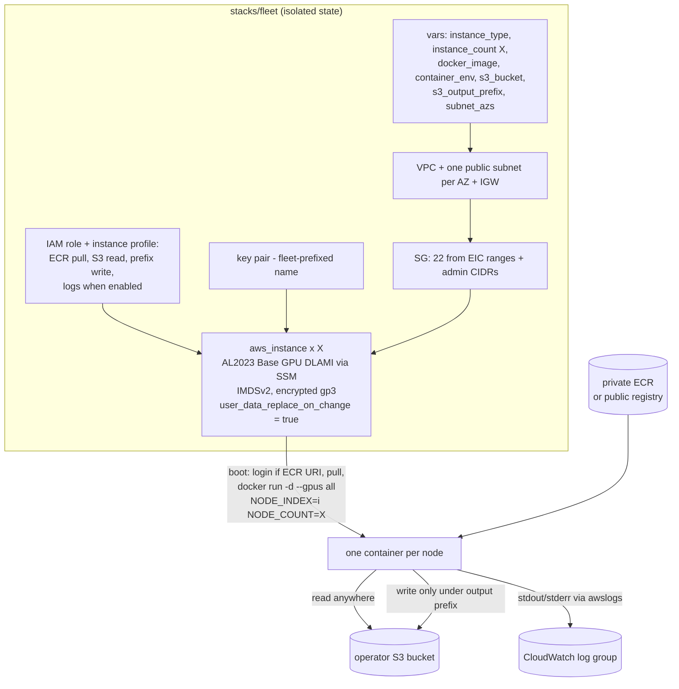
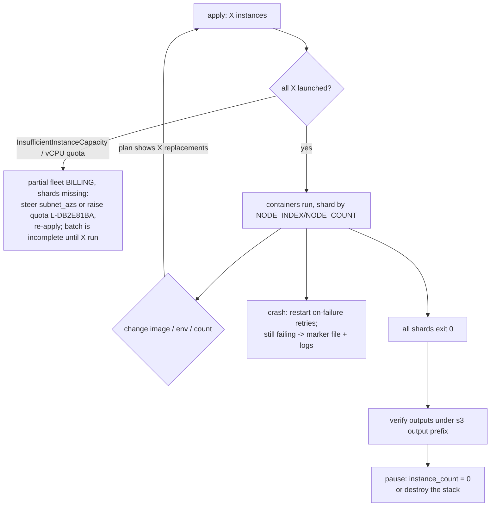

# On-Demand GPU Fleet - Plan

## Goal Capsule

- **Objective:** A third self-contained OpenTofu stack (`stacks/fleet`) where an engineer sets an instance type (default `g6e.xlarge`), a count X, and a docker image, applies once, and gets X on-demand GPU instances — each running one container at boot with `NODE_INDEX`/`NODE_COUNT` injected so a batch workload shards itself across the fleet. No capacity block anywhere in this path; the purchase and p5 runtime stacks stay untouched.
- **Authority:** This plan > repo conventions. Requirements (R-IDs) win on product behavior; KTDs win on implementation mechanism. The p5 runtime stack's files are read-only reference patterns, never edit targets.
- **Execution profile:** `execution: code` — HCL, a bash user_data template, tests, and docs.
- **Stop conditions:** Never apply against a real AWS account — verification is static (`tofu fmt/validate`, `tflint`, mocked plan-only `tofu test`). Never commit `.tfvars`, key material, or state. Surface a blocker if a provider argument named here does not validate.
- **Tail ownership:** The executing workflow owns commits, PR, and CI.

---

## Product Contract

### Summary

Add `stacks/fleet`: multi-AZ VPC, the repo's security-group/key-pair/EIC access pattern, an instance IAM role scoped to ECR pull + one S3 bucket (read everywhere, write under an output prefix), and X on-demand GPU instances on the AL2023 Base GPU DLAMI whose user_data pulls the operator's image and runs exactly one container per node with sharding env vars. Replacement-on-change is the fleet's deployment mechanism. Docs give the fleet its own runbook (quota, AZ availability, partial capacity, updates, completion economics).

### Problem Frame

The repo currently serves one shape of work: huge prepaid p5 capacity blocks. Teams also need cheap, immediate, elastic GPU capacity — many small nodes running the same containerized job over a partitioned dataset — without the purchase ceremony, without a scheduler to operate, and without hand-configuring credentials on boxes. The existing runtime stack cannot express this: it is structurally welded to a capacity reservation (AZ derivation, market options, active-state preconditions), it deliberately has no instance IAM role, and it runs no workload. A different engineer should get from clone to a working sharded fleet with one tfvars file and one apply.

### Requirements

**Fleet provisioning**

- R1. An engineer sets an instance type (default `g6e.xlarge`), an instance count X, and a docker image, applies once, and gets X on-demand GPU instances — no capacity block anywhere in the path.
- R2. Instances spread across multiple availability zones via an operator-steerable subnet/AZ selection.
- R3. `instance_count = 0` is valid and is the documented pause mechanism — networking, role, and key pair persist at near-zero cost.

**Container execution**

- R4. Each node runs exactly one container at boot with `NODE_INDEX` (0-based), `NODE_COUNT`, and operator-supplied env vars injected, and with explicit GPU access (`--gpus all`).
- R5. The container restart policy is a variable; the default suits a batch job — bounded retries on failure, never re-running a shard that exited 0.
- R6. The image may live in same-account private ECR or a public registry; ECR login happens automatically when, and only when, the image URI is a private-ECR one, with the registry region parsed from the URI itself.
- R7. A boot, pull, or run failure fails loudly: nonzero cloud-init exit, a FATAL console-log line, and a login-visible marker file (the repo's established idiom).
- R8. Container stdout/stderr ship to CloudWatch Logs via Docker's `awslogs` driver, toggleable, default on.

**Access and IAM**

- R9. Instances carry an IAM role scoped to exactly: the ECR pull set, bucket-wide S3 read, S3 write under an operator-set output prefix, and — when logs are enabled — the three log-write actions. Nothing else, and no long-lived credentials anywhere.
- R10. Admin access matches the house pattern (SSH from EC2 Instance Connect ranges plus validated admin CIDRs; existing-key-pair-name XOR public-key), with fleet-specific default resource names that cannot collide with the runtime stack in the same region.

**Update and safety**

- R11. Changing the image, env vars, count, or any other user_data input replaces the fleet's instances — replacement is the deployment mechanism, a documented divergence from the p5 stack's `ignore_changes` stance.
- R12. No secrets in the repo or in state: operator env vars are documented as non-secret (user_data is stored plaintext in state under provider 6.x), and the plan never introduces static credentials.
- R13. Documentation covers the fleet's operational realities: the G/VT on-demand vCPU quota, g6e region/AZ offering checks, partial-capacity recovery, update and scale semantics, batch completion and teardown economics, and why this stack has an IAM role when the p5 stack refuses one.

### Acceptance Examples

- AE1. **Sharded boot.** Given `instance_count = 4` and a public image, apply plans 4 instances across at least 2 subnets/AZs, and each rendered user_data carries `NODE_INDEX` equal to its instance index and `NODE_COUNT=4`. Covers R1, R2, R4.
- AE2. **ECR detection.** Given `docker_image = "<acct>.dkr.ecr.us-west-2.amazonaws.com/train:v3"` with `region = "us-east-2"`, the rendered user_data logs into the us-west-2 registry (region from the URI) and the ECR pull policy targets that repository's ARN; given `ghcr.io/org/train:v3`, no login block renders and no ECR policy is created. Covers R6, R9.
- AE3. **Replacement is deployment.** Given a running fleet, changing `docker_image` (or `instance_count`, or an env var) plans replacement of every instance — never an in-place update, never a silent no-op. Covers R11.
- AE4. **Pause.** Setting `instance_count = 0` plans zero instances while VPC, security group, key pair, and role remain. Covers R3.
- AE5. **Least-privilege policy.** The role's policy JSON contains only the enumerated actions; S3 write actions appear only with resources under `<bucket>/<output_prefix>/*`; disabling logs removes the `logs:` statement. Covers R9, R8.

### Scope Boundaries

**Out of scope**

- Any scheduler or control plane (ECS, EKS, Batch, Slurm) — sharding is the workload's job via the injected env vars.
- Cross-account ECR, image building/pushing, and registry lifecycle.
- FSx for Lustre — a p5-stack feature; fleet data moves through S3.
- Managing the S3 bucket itself (it is operator-supplied, like the p5 stack's FSx bucket).
- Autoscaling, spot instances, and job-queue automation.

**Deferred to Follow-Up Work**

- A spot-instance toggle (interruption handling needs its own design).
- Automatic idle-fleet stop on batch completion (e.g. node self-stop on exit 0).
- CloudWatch alarms/dashboards on top of the log group.
- Shared-module extraction across the three stacks if a fourth stack ever appears.
- Cross-account ECR pull (requires a far-side repository policy).

---

## Planning Contract

### Key Technical Decisions

- KTD1. **A third self-contained stack, `stacks/fleet`** (session-settled: user-approved — chosen over extracting shared modules from the shipped runtime stack: the repo's deliberate stack isolation stays intact and the p5 stack is never refactored under a feature deadline). Patterns are copied and adapted; divergences are commented at the point of divergence.
- KTD2. **Plain EC2 fleet with self-sharding containers** (session-settled: user-approved — chosen over an ECS cluster or EKS: zero new control plane, matches the repo's bare-EC2 + user_data idiom; the scheduler alternative lives in Scope Boundaries). `NODE_INDEX` comes from the instance's count index; `NODE_COUNT` from the count variable; shard assignment is the container's contract, not the infrastructure's.
- KTD3. **Batch-shaped container contract** (session-settled: user-approved — chosen over a long-running-service default): the container runs detached under a fixed name with `--gpus all` explicit (research: do not rely on the DLAMI setting nvidia as Docker's default runtime), restart policy defaults to bounded `on-failure` retries (a completed shard never re-runs; a crash retries without human help), env vars pass via an env file rather than interpolated flags (shell-safety + template idempotency), and a `docker rm -f` guard keeps manual re-runs safe per the template's house contract.
- KTD4. **One instance IAM role, standalone policy resources, enumerated grants** (session-settled: user-approved — ECR + S3 access chosen over the p5 stack's no-role posture; the output-prefix write was proposed after flow analysis showed a read-only role strands batch results, and accepted). Grants: `ecr:GetAuthorizationToken` on `*` (API constraint), the three pull actions on the repository ARN derived from the image URI, `s3:ListBucket` on the bucket + `s3:GetObject` on `<bucket>/*`, `s3:PutObject`/`s3:AbortMultipartUpload`/`s3:ListMultipartUploadParts` only under `<bucket>/<output_prefix>/*`, and the three `logs:` actions when logs are enabled. Use standalone `aws_iam_role_policy`/`aws_iam_role_policy_attachment` — the embedded `inline_policy`/`managed_policy_arns` arguments are deprecated in provider 6.x.
- KTD5. **Replacement-on-change is the deployment mechanism.** `user_data_replace_on_change = true`, no `ignore_changes`, and no `create_before_destroy` on the instances. This deliberately inverts the p5 stack's `ignore_changes = [user_data]`: that stack protects irreplaceable prepaid capacity; this fleet is stateless and cheap, and the alternative (ignoring user_data) turns image updates and `NODE_COUNT` corrections into silent no-op plans that corrupt shard math. `create_before_destroy` is excluded because a replacement overlap would run two live nodes with the same `NODE_INDEX`. Consequences documented per R13: any image/env/count change replaces the whole fleet; `latest` tags go version-heterogeneous on partial replacement, so the runbook recommends digest-pinned URIs.
- KTD6. **AL2023 Base GPU DLAMI only, resolved via the same SSM parameter the p5 stack uses** (`base-oss-nvidia-driver-gpu-amazon-linux-2023`), plus an `ami_id` escape hatch. Research confirmed one AMI covers G6e and the p5 family; the AL2 flavor is EOL (frozen June 2026) and is not offered here — no `ami_flavor` variable in this stack.
- KTD7. **ECR detection is a URI-shape rule:** an image matching `\.dkr\.ecr\.([a-z0-9-]+)\.amazonaws\.com/` is private ECR — login uses the captured region and the pull policy uses the derived repository ARN; `public.ecr.aws` and other registries get no login and no ECR policy. Cross-region pulls therefore work; cross-account stays deferred.
- KTD8. **Observability = awslogs + loud boot failure, no agent.** Docker's `awslogs` log driver ships container output to a fleet log group using the instance role (default on; disabling removes the `logs:` grant). Boot/pull/run failures reuse the fsx.tf idiom: FATAL console line, login-visible `/etc/profile.d/00-fleet-broken.sh` marker, nonzero exit. The runbook carries a fleet-status one-liner (EIC + `docker inspect` over the instance IDs). No CloudWatch agent, alarms, or dashboards — named boundary.
- KTD9. **AZ steering.** A `subnet_azs`-style variable (default: the first two or three opted-in AZs) creates one public subnet per AZ; instances spread via `element(subnet_ids, count.index)` (element wraps natively — no explicit modulo). The runbook documents checking g6e offerings per AZ (`aws ec2 describe-instance-type-offerings --location-type availability-zone`) and shrinking/steering the AZ list on `InsufficientInstanceCapacity` — the modulo spread otherwise re-targets a failing AZ for the same indices on every retry.
- KTD10. **Naming isolation:** fleet defaults use a `multi-scale-fleet` prefix (key pair name, role/profile names via `name_prefix` where supported, SG, log group) so a fleet and a p5 deployment in the same region never collide on region-unique names.

### High-Level Technical Design

Stack topology and trust boundaries:



Fleet lifecycle — the paths the docs must make boring:



### Output Structure

```text
stacks/fleet/
  main.tf              # provider, locals (ECR parse, names)
  network.tf           # VPC, per-AZ subnets, IGW, routes
  security.tf          # SG: EIC ranges, admin CIDRs
  access.tf            # key pair (fleet-prefixed)
  iam.tf               # role, instance profile, scoped policies
  instance.tf          # AMI resolution, fleet instances
  outputs.tf
  variables.tf
  versions.tf
  terraform.tfvars.example
  templates/
    user_data.sh.tpl   # ECR login, pull, docker run, failure markers
  tests/
    fleet.tftest.hcl   # mocked plan-only suite
```

The tree is a scope declaration; per-unit `Files` lists stay authoritative.

---

## Implementation Units

### U1. Fleet stack scaffold: network, security group, key pair

- **Goal:** A valid `stacks/fleet` root with multi-AZ networking and the house access pattern under fleet-specific names.
- **Requirements:** R2, R10; enables all others.
- **Dependencies:** none.
- **Files:** `stacks/fleet/versions.tf`, `stacks/fleet/main.tf`, `stacks/fleet/network.tf`, `stacks/fleet/security.tf`, `stacks/fleet/access.tf`, `stacks/fleet/variables.tf`, `stacks/fleet/terraform.tfvars.example`, `stacks/fleet/tests/fleet.tftest.hcl`.
- **Approach:**
  1. `versions.tf` copies the runtime stack's pins (OpenTofu >= 1.10, aws >= 6.53 < 7.0) and commented backend/encryption examples with a `multi-scale/fleet` state key.
  2. `subnet_azs` variable (list, default e.g. two AZ suffixes for the region) drives one public subnet per AZ per KTD9; VPC/IGW/routes mirror `stacks/runtime/network.tf` minus the reservation-derived AZ.
  3. `security.tf` mirrors `stacks/runtime/security.tf` (EIC ranges via `aws_ip_ranges`, validated `admin_cidr_blocks` rejecting world-open, allow-all egress) without the Lustre rules.
  4. `access.tf` mirrors the runtime key-pair XOR pattern with `key_pair_name` defaulting to `multi-scale-fleet` per KTD10, using `key_name_prefix`.
- **Patterns to follow:** `stacks/runtime/network.tf`, `stacks/runtime/security.tf`, `stacks/runtime/access.tf`, `stacks/runtime/variables.tf` (section-comment style, validation shapes — including the IPv4-only shape check on admin CIDRs the review recommended for the runtime stack).
- **Test scenarios:**
  - Default `subnet_azs` → one subnet per listed AZ, each `map_public_ip_on_launch = true`.
  - `admin_cidr_blocks = ["0.0.0.0/0"]` → expect_failures on the validation (red-proof).
  - Neither / both key variables set → expect_failures on the XOR validation.
  - Port 22 ingress carries only mocked EIC ranges when `admin_cidr_blocks` is empty.
- **Verification:** `tofu validate`, `tflint`, and the U1 test runs pass in `stacks/fleet`; `pre-commit run` green.

### U2. Instance IAM role and scoped policies

- **Goal:** The fleet's only credentials: a role/instance-profile pair granting exactly KTD4's enumerated set.
- **Requirements:** R9, R8 (logs grant), R6 (pull policy); cites KTD4.
- **Dependencies:** U1.
- **Files:** `stacks/fleet/iam.tf`, additions to `stacks/fleet/variables.tf` (`docker_image`, `s3_bucket`, `s3_output_prefix`, `enable_container_logs`), `stacks/fleet/tests/fleet.tftest.hcl`.
- **Approach:**
  1. Locals per KTD7 parse the image URI: `is_ecr`, registry region, repository ARN. Validation: `docker_image` required, non-empty; `s3_bucket` bare-name validation (reuse the fsx bucket-name shape); `s3_output_prefix` default `outputs`, validated non-empty without leading/trailing slash.
  2. Role with EC2 trust, `name_prefix` per KTD10; instance profile referenced by resource attribute so the graph orders correctly.
  3. Standalone `aws_iam_role_policy` documents per KTD4: ECR statement pair (count-gated on `is_ecr`), S3 read + prefix-write statements, `logs:` statement count-gated on `enable_container_logs`.
- **Patterns to follow:** the sample policy JSON structure in `docs/admin-access.md` for statement shape; runtime stack's variable-validation style.
- **Test scenarios:**
  - ECR image → policy JSON contains the 3 pull actions scoped to the derived repository ARN and `GetAuthorizationToken` on `*` (AE2 half).
  - Public image (`ghcr.io/...`) → zero ECR policy resources.
  - Write actions appear only with resources under `<bucket>/<prefix>/*`; read is bucket-wide (AE5).
  - `enable_container_logs = false` → no `logs:` statement.
  - `s3_output_prefix = "/bad/"` → expect_failures on validation.
- **Verification:** U2 test runs pass; policy JSON parses (test assertions on `jsondecode`).

### U3. Fleet instances with replacement-on-change lifecycle

- **Goal:** X on-demand instances on the right AMI with the fleet's deliberate update semantics.
- **Requirements:** R1, R3, R11; cites KTD5, KTD6, KTD9.
- **Dependencies:** U1, U2.
- **Files:** `stacks/fleet/instance.tf`, additions to `stacks/fleet/variables.tf` (`instance_type` default `g6e.xlarge`, `instance_count` validated 0-64, `ami_id` override, `root_volume_size_gib` >= 100), `stacks/fleet/outputs.tf`, `stacks/fleet/tests/fleet.tftest.hcl`.
- **Approach:**
  1. AMI per KTD6: SSM data source on the AL2023 path (count-gated off when `ami_id` set).
  2. `aws_instance` count = `instance_count`, subnet via `element(subnet_ids, count.index)`, IMDSv2 required with hop limit 2, encrypted gp3 root, instance profile from U2, `Name = <prefix>-<index>` tags.
  3. Lifecycle per KTD5: `user_data_replace_on_change = true`, no `ignore_changes`, no `create_before_destroy` — with a comment block as loud as the p5 stack's explaining the divergence and the duplicate-NODE_INDEX hazard.
  4. Outputs: instance ids/IPs/DNS as index-keyed maps, per-index EIC and ssh connect commands, log group name when enabled.
- **Patterns to follow:** `stacks/runtime/instance.tf` (metadata options, root volume, outputs shape) minus all reservation machinery.
- **Test scenarios:**
  - `instance_count = 4` with 2 subnets → instances alternate subnets (AE1 spread half).
  - `instance_count = 0` → zero instances, VPC/SG/key/role still planned (AE4).
  - `ami_id` set → zero SSM data sources; default → the AL2023 SSM path.
  - `metadata_options` http_tokens required; root volume encrypted (mirror runtime assertions).
  - Comment-anchored NOTE in the test file: the replacement-on-change contract is apply-time behavior a plan-only mock cannot regression-test — documented, not fabricated.
- **Verification:** full fleet suite passes; `tofu validate`/`tflint` clean.

### U4. Container runtime user_data

- **Goal:** The boot contract: authenticate when needed, pull, run one GPU container with sharding env, fail loudly, log durably.
- **Requirements:** R4, R5, R6, R7, R8, R12; cites KTD3, KTD7, KTD8.
- **Dependencies:** U2 (role grants), U3 (template consumer).
- **Files:** `stacks/fleet/templates/user_data.sh.tpl`, additions to `stacks/fleet/variables.tf` (`container_env` map default {}, `container_run_args` string default "", `restart_policy` validated to none/on-failure/unless-stopped with default `on-failure`, `restart_max_retries`), `stacks/fleet/tests/fleet.tftest.hcl`.
- **Approach:**
  1. Template renders per-instance with `node_index`, `node_count`, image, env map, restart policy, log group; bash strict mode.
  2. ECR branch per KTD7: `aws ecr get-login-password --region <uri-region> | docker login` only when `is_ecr` (CLI v2 preinstalled on the AMI).
  3. Run contract per KTD3: write env file (`NODE_INDEX`, `NODE_COUNT`, then operator vars), `docker rm -f <name>` guard, `docker run -d --name <fixed> --gpus all --env-file ... --restart <policy>` plus awslogs `--log-driver`/`--log-opt` flags when logs enabled (`awslogs-create-group=true`).
  4. Failure idiom per KTD8: pull and run wrapped so failure writes `/etc/profile.d/00-fleet-broken.sh`, prints FATAL, exits 1; success path removes a stale marker (mirror `stacks/runtime/fsx.tf`'s mount fragment).
  5. `container_env` description carries the R12 no-secrets rule verbatim: values land in plaintext state and in `DescribeInstanceAttribute` — fetch secrets at runtime instead.
- **Execution note:** render the template both ways (ECR and public image) to a scratch file and prove `bash -n` cleanliness plus presence/absence of the login block before wiring assertions — the template's escaping (`HCL ${}` vs bash) is where this unit breaks.
- **Patterns to follow:** `stacks/runtime/templates/user_data.sh.tpl` (strict-mode header, idempotency contract comment) and `stacks/runtime/fsx.tf`'s loud-failure fragment.
- **Test scenarios:**
  - Rendered user_data for index 2 of 4 contains `NODE_INDEX=2` and `NODE_COUNT=4` (AE1 env half).
  - ECR image → login block present with the URI's region; public image → absent (AE3-adjacent, AE2).
  - `--gpus all` always present; `--restart on-failure` default; `unless-stopped` when selected.
  - `enable_container_logs = false` → no awslogs flags in rendered output.
  - Operator env var with a space/quote renders shell-safely via the env file (assert the env-file line, not an interpolated flag).
- **Verification:** rendered template passes `bash -n` in both branches; suite green.

### U5. Fleet documentation and runbook

- **Goal:** A different engineer goes clone → sharded fleet with one tfvars file, and knows the money/data edges (R13).
- **Requirements:** R13; documents R1-R12.
- **Dependencies:** U1-U4.
- **Files:** `README.md` (fleet section + a row in the spend table), `docs/runbooks.md` (new fleet runbook section), `stacks/fleet/terraform.tfvars.example` (finalize — every variable commented).
- **Approach:**
  1. README: fleet quickstart (three required variables → apply), the spend-table row ("meter runs until you act — X × ~$2/hr for g6e.xlarge"), quota callout (G/VT on-demand vCPU quota `L-DB2E81BA`, default 0 on new accounts, check command), g6e region/AZ availability note with the `describe-instance-type-offerings` check.
  2. Runbook sections: launch; **updates and scaling** (any image/env/count change replaces the fleet — that is the deployment mechanism; digest-pin images; scale-down removes tail indices); **partial capacity** (ICE vs quota errors, steering `subnet_azs`, "a partial fleet means an incomplete batch even though containers are running"); **fleet status and debugging** (per-index connect commands, `docker inspect` one-liner over instance ids, the broken-marker file, CloudWatch log group); **completion and teardown** (verify outputs under the S3 prefix → `instance_count = 0` to pause or destroy; destroy is SIGKILL — note abandoned multipart uploads and suggest a bucket lifecycle rule); **credentials stance** (why this stack has a role when runbook 8 refuses one; the exact grant list; no-secrets-in-env rule).
- **Patterns to follow:** the existing runbooks' voice — exact variable/output names, real commands, deadlines in bold.
- **Test scenarios:** Test expectation: none — documentation unit. Review checklist instead: every U-section above has a named heading; every fleet variable has a commented tfvars entry; README table row present; no placeholder text; links resolve.
- **Verification:** `pre-commit run` on the docs; a cold read of the quickstart reaches a working tfvars without opening HCL.

---

## Verification Contract

| Gate | Command | Applies to | Proves |
|---|---|---|---|
| Format | `tofu fmt -check -recursive` | all units | style baseline |
| Static validity | `tofu init -backend=false && tofu validate` in `stacks/fleet` | all units | HCL and provider schema correctness |
| Lint | `tflint` in `stacks/fleet` | all units | provider-aware mistakes |
| Unit tests | `tofu test` in `stacks/fleet` (mock provider, plan-only) | U1-U4 | gating, validations, rendering, policy JSON |
| Template sanity | `bash -n` on rendered user_data (both ECR and public branches) | U4 | boot script parses |
| Hooks | `pre-commit run --all-files` | all units | everything wired to commits |

No gate performs a real AWS apply. The existing purchase (7 runs) and runtime (26 runs) suites must stay green — this plan touches neither stack's HCL, so any failure there is a regression to investigate, not accept. Post-merge manual smoke (a real 2-node apply, container start, S3 output check, teardown) is runbook-documented operator verification, not CI.

---

## Definition of Done

- U1-U5 implemented; every Verification Contract gate green locally, including the untouched purchase/runtime suites.
- AE1, AE2, AE4, AE5 provable via `tofu test`; AE3's replacement stance carried by lifecycle configuration plus the documented NOTE (plan-only mocks cannot model in-place state).
- No secrets anywhere: detect-private-key and hooks clean; `container_env` and tfvars examples carry the no-secrets rule.
- README + runbook sections complete per U5's checklist; spend-table row present.
- No dead or experimental HCL from abandoned approaches.

---

## Risks & Dependencies

- **g6e availability is narrow.** ~12 regions, per-AZ offering gaps, and a G/VT vCPU quota that defaults to 0 on new accounts — the most likely first-apply failure is quota, not capacity. Mitigated by README/runbook checks (KTD9, U5); not validatable at plan time.
- **Full-fleet replacement blast radius.** KTD5 makes every image/env/count change replace X instances simultaneously; an operator expecting an in-place tweak loses running shards. Mitigated by loud comments, runbook framing ("that is the deployment mechanism"), and the plan-time replacement being visible in `tofu plan`.
- **DLAMI runtime assumptions.** Whether the DLAMI sets nvidia as Docker's default runtime is unverified — `--gpus all` is passed explicitly; `ec2-instance-connect` presence on the DLAMI is presumed from the AL2023 base (the runtime stack's user_data insurance install is reused).
- **Plaintext user_data in state.** Provider 6.x stores user_data unhashed; operator env vars are one paste away from leaking a token into state. Mitigated by the R12 documentation stance only — unenforceable at plan time.
- **`latest`-tag heterogeneity.** A partial replacement re-pulls a newer digest on recycled nodes. Runbook recommends digest pinning; not enforced.
- **Research pins.** DLAMI g6e support, SSM path, ECR IAM action set, and provider 6.x IAM deprecations were verified against 2026-09 docs; the implementer re-verifies attribute names against `tofu providers schema -json` before relying on them (house rule from the p5 build).

---

## Sources & Research

- DLAMI AL2023 Base GPU AMI supported instances (G6e listed) and SSM path: docs.aws.amazon.com/dlami/latest/devguide/aws-deep-learning-x86-base-gpu-ami-amazon-linux-2023.html (release notes 2026-03 list G4dn-P6; AL2 flavor EOL June 30 2026).
- ECR pull-only IAM action set and `GetAuthorizationToken` `Resource:"*"` constraint: docs.aws.amazon.com/AmazonECR/latest/userguide/security_iam_id-based-policy-examples.html; boot login via `aws ecr get-login-password`: registry_auth docs.
- Provider 6.x IAM deprecations (`inline_policy`/`managed_policy_arns`) and plaintext user_data change: registry.terraform.io/providers/hashicorp/aws docs + v6 upgrade guide.
- Docker restart-policy semantics (on-failure vs unless-stopped, 10-second rule) and awslogs driver using instance-role credentials: docs.docker.com.
- `element()` native wrap-around for subnet spread: developer.hashicorp.com/terraform/language/functions/element.
- g6e regions (~12 as of 2026-02), `L-DB2E81BA` G/VT on-demand vCPU quota defaulting to 0: AWS what's-new + instance-quota docs.
- Fleet lifecycle gaps (stale NODE_COUNT under ignore_changes, ICE retry pinning via modulo spread, read-only-role output contradiction, idle-fleet economics): flow analysis performed during planning; resolutions embedded in KTD4, KTD5, KTD9, U5.
- House patterns: `stacks/runtime/*.tf`, `stacks/runtime/templates/user_data.sh.tpl`, `docs/runbooks.md` (loud-failure idiom, XOR key pair, test conventions, runbook voice).
